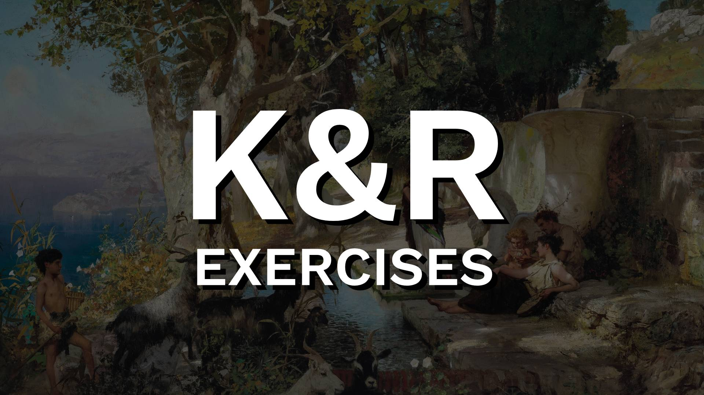

 

    
    
    
    
    

These are my solutions to exercises from the classic "The C Programming Language" by Brian Kernighan and Dennis Ritchie (2nd edition), also referred to as "K&R".
The exercises in the book are very didactic and fun, I hope you enjoy them. :)

<b>Project under development.</b>

 

:bookmark_tabs: Table of Contents
-----
* [Summary](#books-summary)
* [Author](#smiley-author)
* [License](#scroll-license)
-----

 

:books: Summary
---

<b>Chapter 01</b>
- 01 - Hello World
- 02 - Escape sequences
- 03 - Fahrenheit-Celsius conversion table (0 to 300)
- 04 - Celsius-Fahrenheit conversion table
- 05 - Fahrenheit-Celsius conversion table (300 to 0)
- 06 - Verifying the expression value
- 07 - Verifying EOF value
- 08 - Blank space counter
- 09 - Blank replacement
- 10 - Escape sequence replacement
- 11 - Word counter
- 12 - String splitter
- 13 - Word length histogram
- 14 - Character frequency histogram
- 15 - Fahrenheit-Celsius conversion table (using functions)
- 16 - Longest line program (character limit)
- 17 - Print longer than 80 characters
- 18 - Remove trailing blanks and tabs
- 19 - Reverses the string
- 20 - Replaces tabs in the input with the proper number of blanks
- 21 - Replaces strings of blanks with the minimum number of tabs and blanks
- 22 - Splits a long string into short strings
- 23 - Removes all comments from a C program
- 24 - Checks for rudimentary syntax errors 

<b>Chapter 02</b>
- 01 - Type ranges
- 02 - Loop that represents '&& or ||' in another way
- 03 - Hexadecimal to decimal converter
- 04 - Alternate version of squeeze function
- 05 - Occurrence finder
- 06 - Setting bits at a position n
- 07 - Setting bits at a position n inverted
- 08 - Funciton that returns the value of the integer rotated to the right
- 09 - Two's complement number system
- 10 - Upper case to lower case

<b>Chapter 03</b>
- 01 - Binsearch function
- 02 - Escape sequences into the real characters
- 03 - Expand short hand notation into string
- 04 - Itoa to handle largest negative integer
- 05 - Converts an integer into a string
- 06 - Itoa with field width

<b>Chapter 04</b>
- 01 - Find the pattern in the line and print it
- 01 - Strindex which returns rightmost occurance
- 02 - Atof - converts string to double
- 02 - Extend atof to handle scientific notation
- 03 - Reverse Polish Notation calculator 
- 03 - RPN modulus operator and negative numbers
- 04 - RPN Calculator - print two top elements of the stack without popping
- 05 - RPN Calculator with mathematical functions
- 06 - RPN Calculator with variables
- 07 - Function ungets that will push back an entire string onto the input
- 08 - Getch and ungetch handling pushback character
- 09 - Getch and ungetch handling EOF character
- 10 - Calculator using getline
- 11 - Getline using static
- 12 - Convert integer into string by calling recursive routine
- 13 - String reverse function
- 14 - Swap that interchanges two arguments of type t

<b>Chapter 05</b>
- 01 - Get next integer from input
- 02 - Get next float from input
- 03 - Concatenates two strings
- 04 - Checks if a string occurs at the end of another string
- 05 - Simple versions of strncpy, strncat, and strncmp
- 06 - Find the pattern using pointers
- 06 - Pointer to Arrays
- 07 - Readlines using array
- 08 - Date Duration Calculator
- 09 - Date Duration Calculator using pointers
- 10 - Evaluates a reverse polish expression from the command line
- 11 - Entab and detab which accepts arguments
- 12 - Extended entab and detab
- 13 - Prints the last n lines of its input
- 14 - Sorting in reverse order
- 15 - Fold upper and lower case together
- 16 - Compares only letters, numbers and blanks
- 17 - Sorting with options
- 18 - Recover from input errors
- 19 - Undcl that does not add redundant parentheses
- 20 - Expanded dcl to handle declarations with function argument types, qualifiers, and so on

<b>Chapter 06</b>
- 01 - Getword
- 02 - Identical variables
- 03 - Arrays of structures

<b>Chapter 07</b>
- Under development.

<b>Chapter 08</b>
- Under development.

 

:smiley: Author
---

Twitter: [Albrechtcolia](https://twitter.com/albrechtcolia) 

 

:scroll: License
---

[BSD-3-Clause license](license)
